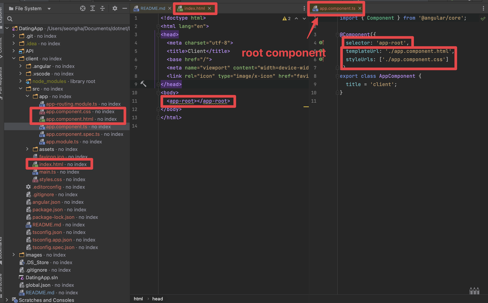
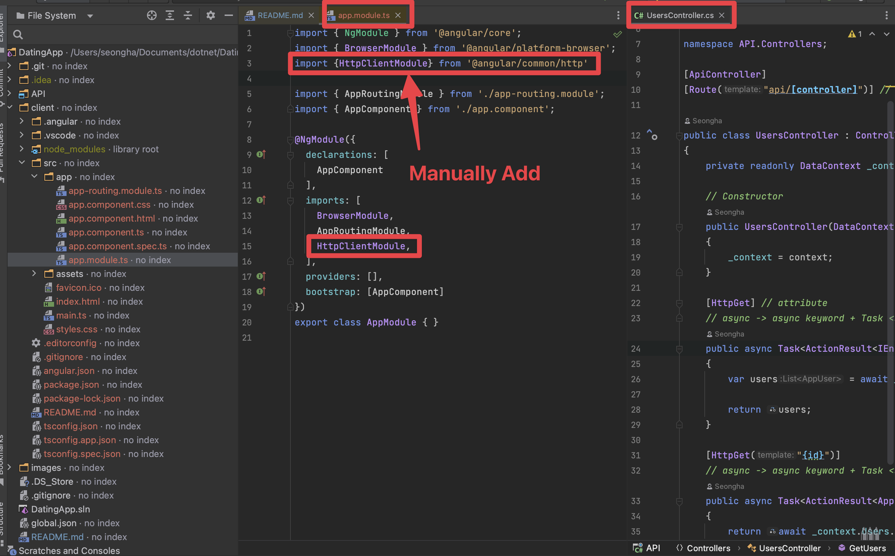
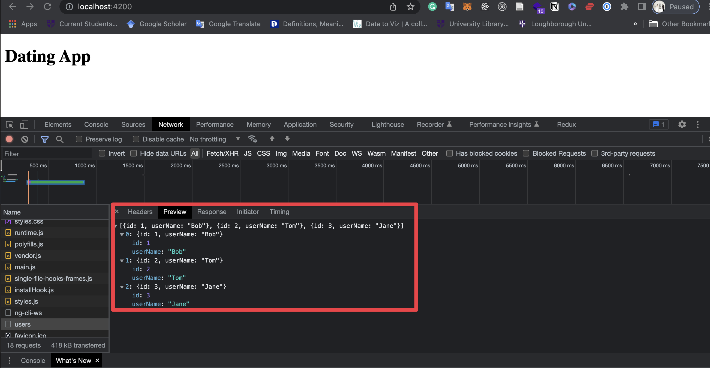
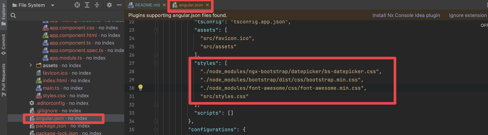

# Dating App Project with Dotnet

# Building a Walking Skeleton (Part 1 - Dotnet)

## 1. Setup

### 1.1 To get information about the available commands and the environment:
```bash
dotnet --info
dotnet -h
```
### 1.2 Lists or modifies the projects in a .NET solution file. 
```bash
dotnet new sln
```

### 1.4 dotnet new webapi –name MyFirstWebAPIProject: With this command, the .NET Core CLI will create a project inside the CLI folder with the name MyFirstWebAPIProject. 
```bash
dotnet new webapi -n API
```

### 1.5 Adds one or more projects to the solution file.
```bash
dotnet sln add API/
```

### 1.6 Lists all projects in a solution file. 
```bash
dotnet sln list
```

### 1.7 Go to API folder
```bash
dotnet run
```
or
```bash
dotnet run -lp https
```
### 1.8 Generates a self-signed certificate to enable HTTPS use in development.
```bash
dotnet dev-certs https --trust
```
### 1.9 Restores the dependencies and tools of a project.
```bash
dotnet restore
```
### 1.10 Restarts or hot reloads the specified application, or runs a specified dotnet command, when changes in source code are detected.
```bash
dotnet watch run
```
## 2. Introduction to Entity Framework
- An Object Relational Mapper (ORM)
- Translates our code into SQL commands that update our tables in the database.
- Features: querying, change tracking, saving, concurrency, transactions, caching, built-in conventions, configurations and migrations


## 3. Adding Entity Framework to Our Project
 - Visit NuGet
 - Install microsoft.entityframework.sqlite
 - Install microsoft.entityframeworkcore.design


## 4. Adding a DbContext Class
- Making API/Data folder
- Making New Class (DataContext.cs)


## 5. Creating the Connection String
- You can visit the below webpage.
https://www.nuget.org/packages/dotnet-ef

- You have to change the directory to be inside of the API folder
```shell
dotnet tool list -g 
dotnet tool install --global dotnet-ef --version 7.0.3
dotnet ef
```
```shell
dotnet ef migrations add InitialCreate -o Data/Migrations
```
 - If you face some errors, you can check the error details through 

```shell
dotnet build
```


## 6. Creating the database using Entity Framework Code first migrations

```shell
dotnet ef database -h
dotnet ef database update
```


## 7. Adding a new API Controller

- go API/Controllers folder

- create class (UsersController.cs)


- Run API Server Run in API
```shell
dotnet watch run
```
- check https://localhost:7008/api/users


- open POSTMAN and creat workspace in POSTMAN


- we can also check the results in Swagger


# 8. Making our code Asynchronous

- go to API/Controllers/Userscontrollers.cs
- change the code using async and await


# 9. Saving our code into Source Control

- Install Git
- Go settings - Github
- Settings/Developer settings
- Tokens(classic)- New personl access token (classic)
- check everything
- Generate Token
- "git status" on CLI
- "git init"
- "dotnet new list"
- "dotnet new gitignore"
- add appsettings.json file to .gitignore
  : API/appsettings.json
- "dotnet new globaljson"
- create new repository on Github
- perform the following comamnd on CLI

```shell
  echo "# csharp-DatingApp" >> README.md
  git init
  git add README.md
  git commit -m "Finished Section 2"
  git branch
```
- Git push using SSH
 
```sheell
git remote add origin git@github.com:sseongha11/csharp-DatingApp.git
git push -u origin main
```

## 10. Learning Goals
Implement the basic API functionality and have an introductory understanding of:

(1) Using the dotnet CLI
(2) API Contollers and Endpoints
(3) Entity Framework
(4) The API Project structure
(5) configuration and Environment variables
(6) Source control

# Building a Walking Skeleton (Part 2 - Angular)

## 1. Introduction

Learning Goals

- Complete the walking skeleton and have an introductory understanding of:

(1) Using the Angular CLI
(2) How to create a new Angular app
(3) The Angular project files
(4) The Angular bootstrap process
(5) Using the Angular HTTP Client Service
(6) Runnnig an Angular app over HTTPS
(7) How to add packages using NPM

## 2. Creating the Angular application

- install node
- check node and npm version
- install globally Angular (check the document)

```shell
npm install -g @angular/cli@14
```
- create the new Angular project
```shell
ng new client
```
- Anglular routing (yes), css 


## 3. Running the angular project and reviewing the bootstrap of the app

- cd client
- start server for the angular project

```shell
ng serve
```
- The root component is src/app/app.component.ts
- check index.html



- check tsconfig.json and angular.json


## 4. Adding VS Code extensions to work with Angular
- install Angular Language Service
- preference - settings - bracket

## 5. Making HTTP request in Angular
- check UsersController.cs
- open app.module.ts

- open app.component.ts


## 6. Adding CORS support in the API
- check the network status on Chrome

- open Program.cs




## 7. Displaying the fetched users in the browser
- open app.component.html


## 8. Adding bootstrap and font-awesome

- [ngx-boostrap](https://valor-software.com/ngx-bootstrap/#/documentation#getting-started)
- go to Client folder
- ng add command
```shell
ng add ngx-bootstrap
```

- npm install font-awesome
- visit and change angular.json


- ng serve
```shell
ng serve
```

## 9. Using HTTPS in angular -MAC
- copy server.key and server.crt

- past files to client/ssl folder

- double click server.crt

- change angular.json

- ng serve command
```shell
ng serve
```


## 10. Saving into source control
- visit Program.cs and change the code


## 11. Summary
